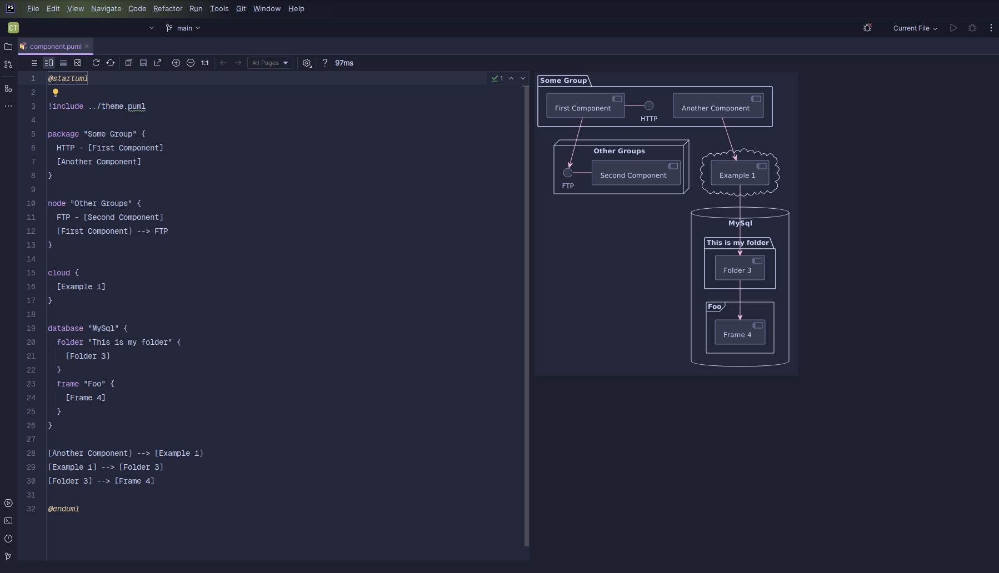
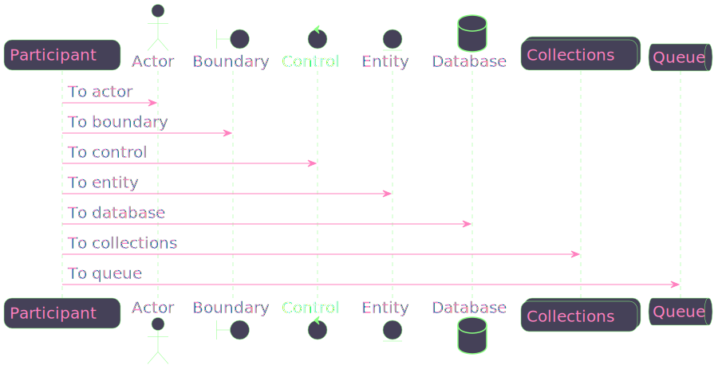
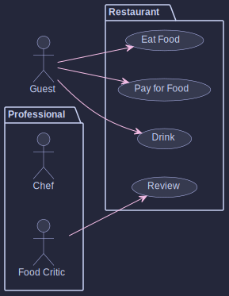
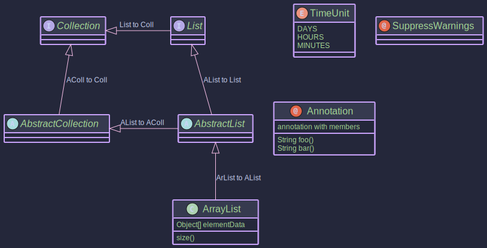
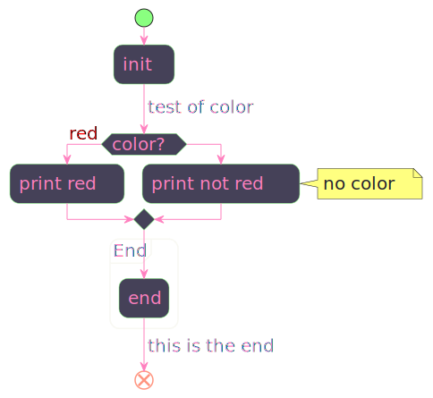
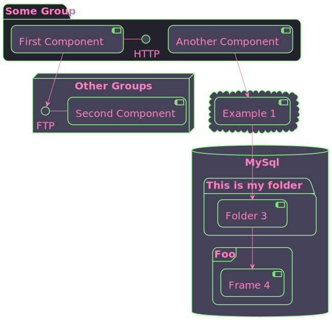

# [Catppuccin (Macchiato)](https://catppuccin.com/) [PlantUML](https://plantuml.com) theme

Based on the [Catppuccin (Macchiato)](https://github.com/catppuccin/catppuccin) palette and the [Dracula PlantUML 
theme](https://github.com/guipatriota/dracula-plantuml-theme).

## Screenshots

JetBrains:



<!-- Visual Studio Code:

-->

## Usage

[`!include`](https://plantuml.com/preprocessing#393335a6fd28a804) the theme file:

```puml
@startuml

!include https://raw.githubusercontent.com/ncosta-ic/catppuccin-macchiato-plantuml-theme/main/theme.puml

Bob->Alice : hello

@enduml
```

## Examples

Sequence diagram:



Use case diagram:



Class diagram:



Activity diagram:



Component diagram:



State diagram:


